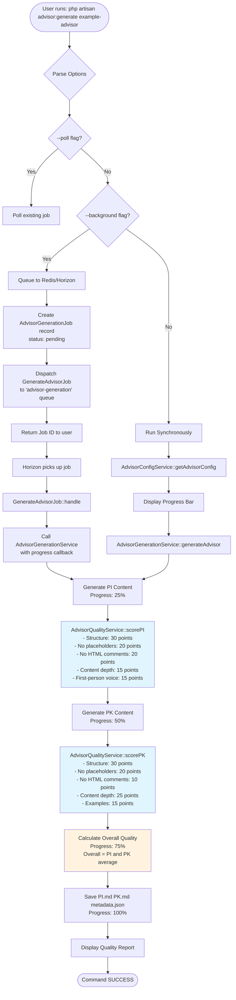
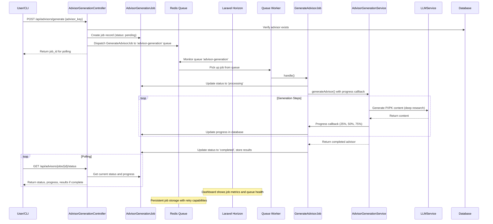

# Advisor Generation System Documentation

## Overview

The Advisor Generation System is a comprehensive background job processing system built with Laravel Horizon and Redis for generating AI advisors. It supports both synchronous and asynchronous generation with real-time progress tracking, quality validation, and monitoring capabilities.

## Architecture Diagram



## Background Processing Architecture



## Quality Scoring System

### Overview
The quality scoring system evaluates generated advisors for comprehensive feedback. Each advisor is scored on a 100-point scale based on multiple criteria.

### Scoring Breakdown

#### PI (Project Instructions) - 100 Points Total

| Criterion | Points | Description |
|-----------|--------|-------------|
| **Structure** | 30 | Validates presence of required sections: Voice Authenticity Anchors, Core Operating Principles, Chain-of-Thought Conditioning, Few-Shot Behavioral Priming, Domain Expertise Boundaries, Response Quality Standards |
| **No Placeholders** | 20 | Ensures all template variables (e.g., `{{advisor_name}}`) are replaced |
| **No HTML Comments** | 20 | Verifies all `<!-- comments -->` are processed/removed |
| **Content Depth** | 15 | Analyzes richness and detail of content using NLP metrics |
| **First-Person Voice** | 15 | Ensures consistent use of "I" statements for authenticity |

#### PK (Project Knowledge) - 100 Points Total

| Criterion | Points | Description |
|-----------|--------|-------------|
| **Structure** | 30 | Validates sections: Voice Anchor, Challenge & Acceptance Criteria, Communication Format Rules, Primary Framework, Secondary Framework, Battle-Tested Application |
| **No Placeholders** | 20 | Same as PI validation |
| **No HTML Comments** | 10 | Less critical for PK content |
| **Content Depth** | 25 | Higher weight on comprehensive knowledge documentation |
| **Examples** | 15 | Checks for specific examples and use cases |

### Quality Thresholds

| Score Range | Status | Recommendation |
|-------------|--------|----------------|
| 90-100% | Excellent | Ready for production |
| 80-89% | Good | Minor improvements recommended |
| 70-79% | Acceptable | Consider addressing issues |
| 60-69% | Below Standard | Significant improvements needed |
| <60% | Poor | Major revision required |

### Overall Score Calculation

```
Overall Score = (PI Score + PK Score) / 2
```

## CLI Commands

### Generate Advisor (Synchronous)
```bash
# Generate advisor synchronously (blocks terminal)
php artisan advisor:generate example-advisor


# Show detailed validation feedback
php artisan advisor:generate example-advisor --show-validation
```

### Generate Advisor (Background)
```bash
# Queue generation job to Redis
php artisan advisor:generate example-advisor --background

# Output:
# ✅ Advisor generation job queued successfully!
# 📋 Job ID: 42
# 🔄 Status: pending
```

### Monitor Background Jobs
```bash
# Poll existing job status (watches in real-time)
php artisan advisor:generate example-advisor --poll

# Check Horizon and queue status
php artisan horizon:status --jobs

# Output:
# ✅ Redis is connected and responding
# ✅ Horizon is running
# 📌 Queue 'advisor-generation': 3 jobs pending
```

## API Endpoints

### Start Generation
```http
POST /api/advisors/generate
Content-Type: application/json

{
    "advisor_key": "example-advisor"
}

Response:
{
    "message": "Advisor generation job started successfully",
    "job_id": 42,
    "status": "pending",
    "polling_url": "http://localhost/api/advisors/jobs/42/status"
}
```

### Poll Status
```http
GET /api/advisors/jobs/42/status

Response:
{
    "job_id": 42,
    "advisor_key": "example-advisor",
    "status": "processing",
    "progress": 50,
    "current_step": "Generating PK (Project Knowledge)",
    "created_at": "2024-01-01T12:00:00Z",
    "started_at": "2024-01-01T12:00:05Z"
}
```

### Get Completed Result
```http
GET /api/advisors/jobs/42/result

Response (when completed):
{
    "job_id": 42,
    "advisor_key": "example-advisor",
    "pi_content": "...",
    "pk_content": "...",
    "quality_report": {
        "summary": {
            "overall_score": 87,
            "status": "PASSED",
            "recommendation": "Good quality - minor improvements recommended"
        }
    },
    "completed_at": "2024-01-01T12:05:00Z"
}
```

### List Recent Jobs
```http
GET /api/advisors/jobs?status=completed&limit=10

Response:
{
    "jobs": [...],
    "count": 10
}
```

### Cancel Job
```http
DELETE /api/advisors/jobs/42

Response:
{
    "message": "Job cancelled successfully",
    "job_id": 42
}
```

## Configuration

### Queue Configuration (`config/advisors.php`)
```php
'queue' => [
    'name' => 'advisor-generation',
    'timeout' => 600,           // 10 minutes for LLM operations
    'tries' => 3,               // Retry attempts
    'backoff' => [60, 120, 300], // Exponential backoff
    'memory' => 512,            // Memory limit in MB
],

'polling' => [
    'interval' => 5,            // Poll every 5 seconds
    'max_wait' => 3600,         // Maximum wait time
],
```

### Horizon Configuration (`config/horizon.php`)
```php
'advisor-generation' => [
    'connection' => 'redis',
    'queue' => ['advisor-generation'],
    'balance' => 'auto',
    'maxProcesses' => 2,        // Local: 2, Production: 5
    'memory' => 512,
    'tries' => 3,
    'timeout' => 600,
],
```

## Database Schema

### advisor_generation_jobs Table
```sql
CREATE TABLE advisor_generation_jobs (
    id BIGINT PRIMARY KEY,
    advisor_key VARCHAR(255),
    status ENUM('pending', 'processing', 'completed', 'failed'),
    progress INTEGER DEFAULT 0,
    current_step VARCHAR(255),
    pi_content LONGTEXT,
    pk_content LONGTEXT,
    quality_report JSON,
    error_message TEXT,
    started_at TIMESTAMP NULL,
    completed_at TIMESTAMP NULL,
    created_at TIMESTAMP,
    updated_at TIMESTAMP,
    
    INDEX idx_status (status),
    INDEX idx_advisor_key (advisor_key),
    INDEX idx_status_created (status, created_at)
);
```

## Starting the System

### 1. Start Redis
```bash
# macOS
brew services start redis

# Linux
sudo systemctl start redis

# Docker
docker run -d -p 6379:6379 redis
```

### 2. Start Horizon
```bash
# Development
php artisan horizon

# Production (with Supervisor)
sudo supervisorctl start horizon
```

### 3. Monitor Dashboard
Open your browser to: `http://localhost/horizon`

## Example Workflow

### 1. Background Generation with Monitoring
```bash
# Start generation in background
php artisan advisor:generate marketing-advisor --background
# Output: Job ID: 123 queued successfully

# Check status via CLI
php artisan horizon:status --jobs

# Or monitor via API
curl http://localhost/api/advisors/jobs/123/status

# Or watch progress in real-time
php artisan advisor:generate marketing-advisor --poll
```

### 2. Quality-Controlled Generation
```bash
# Generate with detailed validation feedback
php artisan advisor:generate technical-advisor --show-validation
```

### 3. API-Based Integration
```javascript
// Start generation
const response = await fetch('/api/advisors/generate', {
    method: 'POST',
    headers: { 'Content-Type': 'application/json' },
    body: JSON.stringify({ advisor_key: 'example-advisor' })
});
const { job_id } = await response.json();

// Poll for completion
const pollStatus = async () => {
    const status = await fetch(`/api/advisors/jobs/${job_id}/status`);
    const data = await status.json();
    
    if (data.status === 'completed') {
        console.log('Generation complete!', data.result);
    } else if (data.status === 'failed') {
        console.error('Generation failed:', data.error);
    } else {
        console.log(`Progress: ${data.progress}% - ${data.current_step}`);
        setTimeout(pollStatus, 5000); // Poll every 5 seconds
    }
};

pollStatus();
```

## Troubleshooting

### Redis Connection Issues
```bash
# Check Redis connection
php artisan horizon:status

# Test Redis directly
redis-cli ping
# Should return: PONG
```

### Horizon Not Processing Jobs
```bash
# Check if Horizon is running
ps aux | grep horizon

# Restart Horizon
php artisan horizon:terminate
php artisan horizon
```

### Failed Jobs
```bash
# View failed jobs in Horizon dashboard
http://localhost/horizon/failed

# Or via CLI
php artisan queue:failed

# Retry failed job
php artisan queue:retry {job-id}
```

## Performance Considerations

- **LLM Timeout**: Set to 600 seconds (10 minutes) for complex advisor generation
- **Memory Limit**: 512MB per worker to handle large context windows
- **Retry Strategy**: Exponential backoff (60s, 120s, 300s) to handle API rate limits
- **Queue Isolation**: Dedicated `advisor-generation` queue prevents blocking other jobs
- **Progress Tracking**: Updates at 25%, 50%, 75%, and 100% to minimize database writes

## Security Notes

- API endpoints should be protected with authentication middleware in production
- Horizon dashboard access should be restricted to administrators
- Redis should be configured with password authentication
- Sensitive advisor content should be encrypted at rest