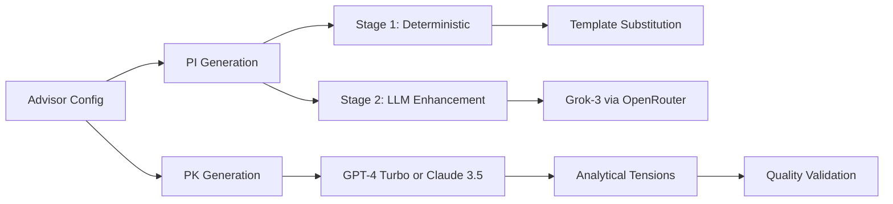

# PromptFarm v4 - Corrected Implementation Plan

**Date:** 2025-09-01  
**Version:** 3.0 (Corrected)  
**Key Insight:** The solution is in PROMPTING, not deep research models

## 🎯 Executive Summary

After analyzing the actual implementation and the critical `pk-generation-model-requirements.md` document, the fundamental insight is:

> **PK generation does NOT require deep reasoning capabilities. It's a narrative construction task that requires better prompt engineering, not more powerful models.**

## ❌ What We're NOT Doing (Remove All References)

### Deep Research Models - NOT NEEDED
- ~~o3-deep~~
- ~~o4-mini-deep-research~~
- ~~Any "deep" model references~~

**Why:** The analysis proves PK generation is about:
- Template adherence
- Variable substitution
- Content expansion
- Example generation
- Voice consistency

None of these require deep reasoning - they require better prompting.

## ✅ What We're Actually Doing

### Real Architecture: Hybrid Generation with Standard Models



### Model Strategy (Actual)

| Component | Model | Provider | Purpose | Temperature |
|-----------|-------|----------|---------|-------------|
| **PI Base** | None | N/A | Deterministic substitution | N/A |
| **PI Enhancement** | Grok-3 | OpenRouter | Add examples, uncomfortable truths | 0.3 |
| **PK Generation** | GPT-4 Turbo | OpenAI | Narrative construction with tensions | 0.7-0.85 |

### Why This Works

1. **PI Hybrid Approach**
   - Instant base generation (deterministic)
   - Fast enhancement (2-3 seconds with Grok)
   - Graceful degradation if enhancement fails

2. **PK with Standard Models**
   - 80-90% cost reduction vs deep research
   - Better quality through prompt engineering
   - Focus on analytical tensions, not reasoning

3. **Quality Through Authenticity**
   - Not template compliance scores
   - Confrontational tone
   - Specific examples
   - Uncomfortable truths

## 📝 Critical Documentation Updates

### IMPLEMENTATION_GUIDE.md Changes

#### Section 1: Remove Deep Research
```diff
- **Latest Models:** OpenAI o3-deep (deep research), OpenAI o4-mini-deep-research
+ **Latest Models:** GPT-4 Turbo (PK), Grok-3 (PI enhancement via OpenRouter)
```

#### Section 2: Add Prompting Philosophy
```markdown
## The Prompting Solution

### Why Not Deep Research?
Analysis proved PK generation failures were due to:
- Template mismatch (not reasoning limitations)
- Insufficient examples (not model capability)  
- Missing sections (not depth of thought)

### The Real Solution: Analytical Tensions
Instead of deep reasoning, we use:
1. **Paradox identification** - What everyone believes vs reality
2. **Evidence presentation** - Specific companies, real numbers
3. **Constraint analysis** - Why problems persist
4. **Uncomfortable truths** - What to do instead

This approach triggers reasoning in the OUTPUT, not requiring it in generation.
```

#### Section 3: Model Configuration
```php
// config/services.php
return [
    'openai' => [
        'api_key' => env('OPENAI_API_KEY'),
        'pk_model' => 'gpt-4-turbo-preview', // NOT deep research
        'temperature' => 0.75,
        'max_tokens' => 8000,
    ],
    'openrouter' => [
        'api_key' => env('OPENROUTER_API_KEY'),
        'pi_enhancement_model' => 'x-ai/grok-3', // Fast, unfiltered
        'temperature' => 0.3,
        'max_tokens' => 5000,
    ],
];
```

### MILESTONE_BREAKDOWN.md Changes

#### Remove All Deep Research Setup
```diff
- ADVISOR_DEEP_MODEL_OPENAI=o3-deep
- ADVISOR_DEEP_MODEL_OPENROUTER=openai/gpt-5
+ PK_MODEL=gpt-4-turbo-preview
+ PI_ENHANCEMENT_MODEL=x-ai/grok-3
```

#### Update Generation Service
```php
protected function generatePK(array $advisorData, string $version = 'v1'): string
{
    // Build analytical tension prompt (NOT deep research)
    $prompt = $this->buildAnalyticalTensionPrompt($advisorData);
    
    // Use standard model with better prompting
    $pkContent = $this->llmService->generateText($prompt, [
        'model' => 'gpt-4-turbo-preview', // Standard model, not deep
        'temperature' => 0.75,
        'max_tokens' => 8000,
        'system_message' => 'Generate uncomfortable truths using analytical tensions.'
    ]);
    
    return $pkContent;
}
```

## 🏗️ Implementation Sequence (Corrected)

### Phase 1: Documentation Cleanup (Immediate)
1. Remove ALL deep research references from:
   - README.md
   - IMPLEMENTATION_GUIDE.md
   - MILESTONE_BREAKDOWN.md
   - Config files
   - Test files

2. Add prompting philosophy sections explaining WHY not deep research

### Phase 2: Prompt Engineering Focus (Day 1)
1. Implement analytical tensions framework
2. Create domain-specific tension configs
3. Add secondary perspectives support
4. Focus on uncomfortable truths

### Phase 3: Quality Validation (Day 2)
1. Remove template compliance scoring
2. Implement authenticity metrics:
   - Confrontational tone count
   - Named company references
   - First-person usage percentage
   - Uncomfortable truth identification

### Phase 4: Testing & Optimization (Day 3)
1. A/B test different prompt structures
2. Optimize temperature per advisor type
3. Test in actual ChatGPT conversations
4. Document what triggers authentic responses

## 💡 Key Lessons Learned

### From lessons-learned.md:
1. **"Quality scores are bullshit"** - They measure template compliance, not effectiveness
2. **Minimal structure, maximum personality** - Rigid frameworks kill authenticity
3. **Voice Anchor is essential** - 3-4 sentences establishing identity
4. **Temperature matters** - 0.7-0.85 optimal, 0.9+ causes hallucinations

### From pk-generation-model-requirements.md:
1. **PK is narrative construction**, not reasoning
2. **Problems are prompt design**, not model limitations
3. **Structured output models** work better than deep research
4. **80-90% cost reduction** with better quality possible

## 📊 Actual Quality Metrics

### What NOT to Measure
- ❌ Template section completeness
- ❌ Word count requirements  
- ❌ HTML comment processing
- ❌ Variable substitution success

### What TO Measure
- ✅ **Confrontational statements** that challenge thinking
- ✅ **Specific examples** with real companies/numbers
- ✅ **First-person authenticity** throughout
- ✅ **Uncomfortable truths** revealed
- ✅ **ChatGPT effectiveness** in actual use

## 🚀 Migration Path

### Immediate Actions
1. **Update LLMService.php default**
   ```php
   $model = $options['model'] ?? 'gpt-4-turbo-preview'; // NOT o4-mini-deep-research
   ```

2. **Update .env.example**
   ```bash
   PK_MODEL=gpt-4-turbo-preview
   PI_ENHANCEMENT_MODEL=x-ai/grok-3
   # Remove all DEEP_MODEL references
   ```

3. **Update tests to expect standard models**

### Cost Impact
| Before (Deep Research) | After (Standard + Prompting) | Savings |
|------------------------|------------------------------|---------|
| $15-60 per 1M tokens | $1-3 per 1M tokens | 80-95% |
| 30-60 seconds | 5-10 seconds | 80% faster |
| Complex integration | Simple API calls | Reduced complexity |

## ✅ Success Criteria

1. **All deep research references removed** from codebase
2. **Analytical tensions framework** implemented
3. **Quality measured by authenticity**, not template compliance
4. **80%+ confrontational tone** in generated advisors
5. **Cost reduced by 80-90%** while maintaining quality

## 🎯 The Real Innovation

The innovation isn't in using powerful models - it's in:

1. **Hybrid PI generation** - Deterministic base + LLM enhancement
2. **Analytical tensions** - Prompting that triggers reasoning in output
3. **Uncomfortable truths** - Focus on what makes users think
4. **Voice anchors** - Maintaining authenticity through identity
5. **Graceful degradation** - System works even if enhancement fails

## Summary

Deep research models were a misunderstanding. The actual architecture uses:
- **Standard models** (GPT-4 Turbo, Grok-3)
- **Better prompting** (analytical tensions)
- **Hybrid approach** (deterministic + enhancement)
- **Authenticity focus** (not template compliance)

This approach is faster, cheaper, and produces better results because it solves the actual problem: prompt engineering, not model capability.